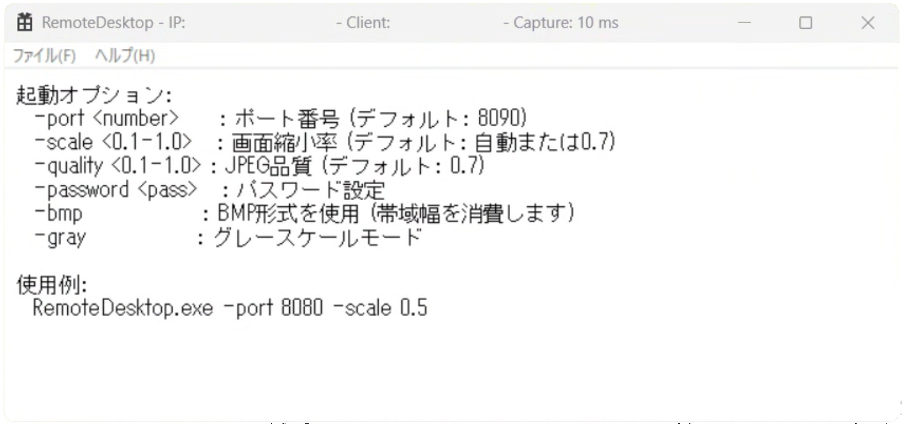
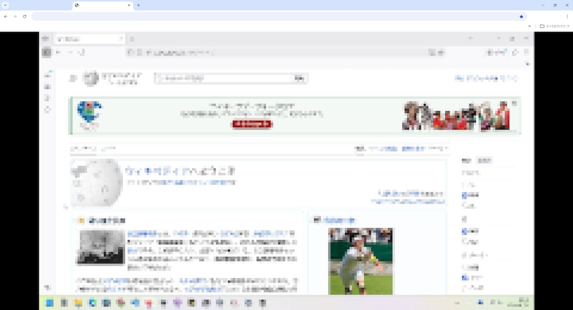

# AI Coding Remote Desktop

AI Coding Remote Desktop is a remote desktop application implemented with only the essential features.  
The coding for this application was performed 100% by AI alone.  

While the implemented features are kept to the bare minimum,  
its performance has already reached a practical level at this stage. 

[English](README.md) / [日本語](README_JA.md)

Server Window

Client Screen

## System Requirements

Server (operated side)
* Windows 11  

Client (operating side)
* Modern web browser (PC and smartphone)  

## How to Use

This application runs as a single binary.  
Download it from Releases and launch RemoteDesktop.exe.  

Use a web browser as the client (viewer).  
Access the following URL from another device:  
http://192.168.xxx.xxx:8090/ 

※ Replace 192.168.xxx.xxx with the private IP address of the device running RemoteDesktop.exe.

> [!CAUTION]
> This application was primarily developed for AI coding verification purposes.
> It is not implemented with security considerations.
> Use it strictly for testing within secure networks only.  

> [!IMPORTANT]
> To prevent misuse by users with insufficient knowledge and unintended external connections,  
> this implementation only permits connections from private IP addresses (192.168.x.x).  
> This restriction cannot be changed.  

## Performance

Despite its simple implementation,  
this app's performance has reached a practical level.  

In terms of user experience, it holds its own against Chrome Remote Desktop  
and typical commercial remote desktop applications.  

On an AMD Ryzen 7 5800H (3.2GHz) system,  
it handles 1920×1080 screen transfers at approximately 25 milliseconds per frame.  

For those interested in pursuing further speed improvements,  
we recommend starting by replacing the JPEG encoder with a faster implementation.

## Startup Options

-port <number>     : Port number (Default: 8090)  
-scale <0.1-1.0>   : Screen scaling factor (Default: Auto or 0.7)  
-quality <0.1-1.0> : JPEG quality (Default: 0.7)  
-password <pass>   : Password setting (BASIC authentication)  
-bmp               : Use BMP format (Consumes bandwidth)  
-gray              : Grayscale mode  

※BASIC authentication is a simple authentication method designed for use within secure networks.

Example usage  
RemoteDesktop.exe -port 8080 -scale 0.5  
                
## Development Environment

Language: C++  
Development Environment: Microsoft Visual C++ 2026  
Framework: Native Windows API  
AI Coding IDE: Google Antigravity  
AI Model: Gemini 3 Pro (High)  

While this technology stack is not commonly adopted in so-called “vibecoding,”  
given the nature of a remote desktop application, minimizing latency was our top priority,  
leading us to choose C++ and the Native Windows API.   

## Development Methodology  

Using Antigravity, this implementation relies solely on Japanese prompts for instructions.  
The coding work was performed 100% by AI alone.  

While no special techniques were used in the prompts themselves,  
requests were described as specifically as possible.  

For example,  
an ambiguous instruction like “Capture the entire desktop screen”  
would be implemented, but  
in that case, it would use an outdated API from the Windows 95 era,  
resulting in extremely poor performance that was unusable.  

Therefore,  

> "Please capture the entire desktop screen using the Windows Graphics Capture API.  
> There is absolutely no need to consider environments that do not support the Windows Graphics Capture API."  

I provided a specific prompt like this, explicitly stating the API to use.    

## Developer
 
MMGames

* [learn through suffering C language](https://9cguide.appspot.com/en/index.html)  
* [Learning C Development Environment](https://9cguide.appspot.com/en/p_9cide.html) 
* [Running in the Browser C Language Execution Environment](https://9cguide.appspot.com/en/web_picoc_em.html)  

## Disclaimer

The author assumes no responsibility whatsoever for any damages arising from the use of this software.  
Use at your own risk.  
